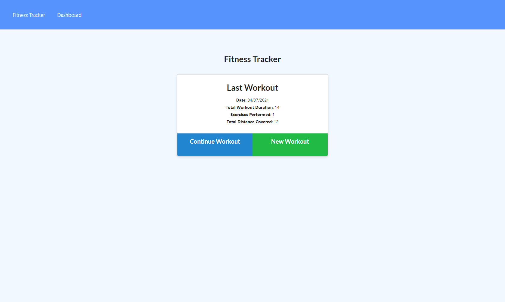
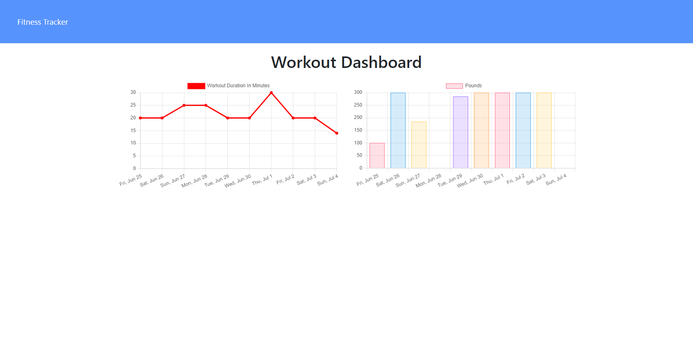

# NoSQL: Workout Tracker

### Table of Contents

- [Description](#description)
- [Installation](#installation)
- [Usage](#usage)
- [Contribution](#contribution)
- [License](#license)

## Description

The workout tracker creates and track daily workouts. It enables to log multiple exercises in a workout on a given day. It tracks the name, type, weight, sets, reps, and duration of exercise. If the exercise is a cardio exercise, it tracks distance traveled.

The user can do the following:

- Add exercises to the most recent workout plan.

- Add new exercises to a new workout plan.

- View the combined weight of multiple exercises from the past seven workouts on the stats page.

- View the total duration of each workout from the past seven workouts on the stats page.

## Mock up

- The following image shows the tracker's functionality

## Home Page

## Stats Page

## Installation

- Clone repository.
- `npm install`
- `node server.js`
- `npm run seed` - to get seed datas.

## Usage

A demo of the application is available [here](https://powerful-escarpment-03587.herokuapp.com/)

## Contribution

Please feel free in making contribution to this repository. But please first discuss the change via email with me. I will try to get back to you as soon as possible.

## Questions

If you have any questions feel free to contact me:

Github Username: sona29

Email: sona.shrestha004@gmail.com

## License

